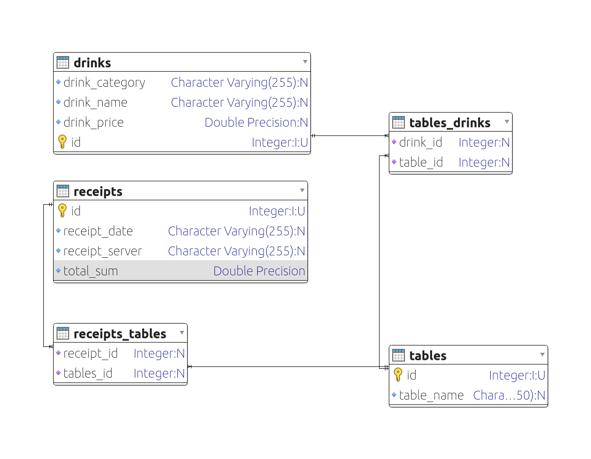
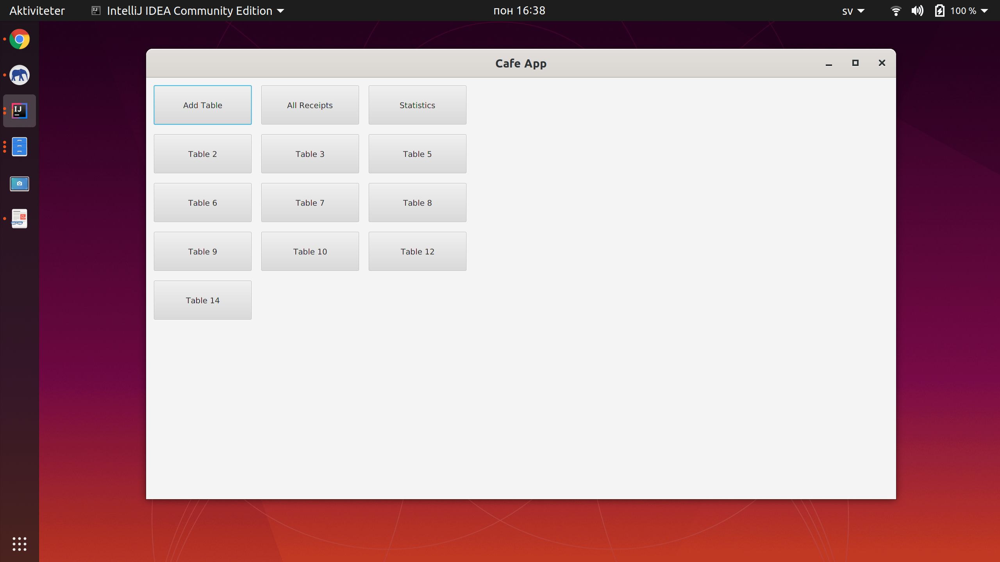
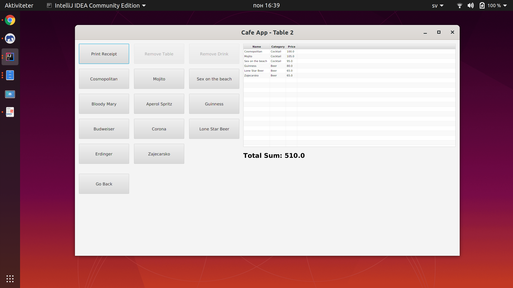
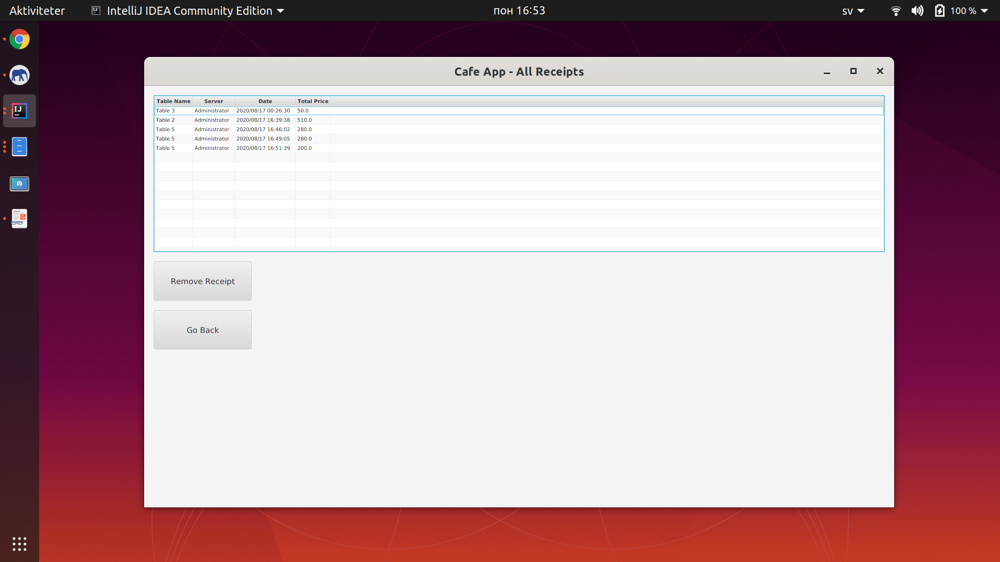
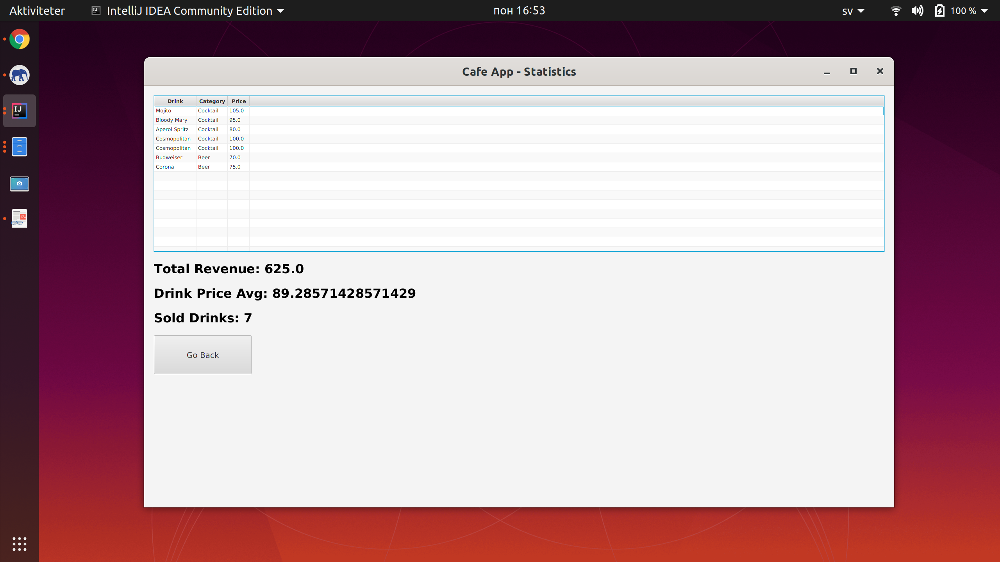

# Cafe Desktop Application

## About
A simple Cafe Desktop Application built using Java 11, JavaFX SDK 11.0.2 and module PostgreSQL 42.2.14.

## Database Design

## Screenshots

  
  
  

## License

The license is MIT. You are free to do whatever you want with it.
